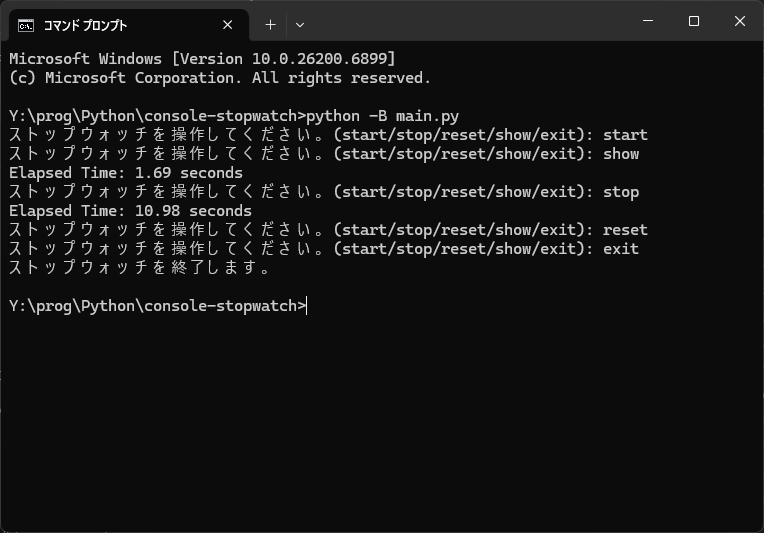

# console-stopwatch

`console-stopwatch`は、コマンドラインで動作するシンプルなストップウォッチアプリケーションです。このプロジェクトは、Pythonプログラミングのハンズオントレーニング教材として作成されました。

クラスの基本的な使い方、`time`モジュールを利用した時間の扱い方、そしてユーザー入力に応じた処理の分岐など、Pythonの基礎を実践的に学ぶことができます。

## 特徴 (Features)

- **計測開始 (`start`)**: ストップウォッチの計測を開始または再開します。
- **計測停止 (`stop`)**: 計測を停止し、経過時間を表示します。
- **リセット (`reset`)**: 計測時間をリセットし、初期状態に戻します。
- **経過時間表示 (`show`)**: 計測中の現在の経過時間を表示します。
- **終了 (`exit`)**: アプリケーションを終了します。

## 実行環境 (Requirement)

- Python 3.x

特別な外部ライブラリは不要です。Pythonの標準ライブラリのみで動作します。

## 使い方 (Usage)

1.  **リポジトリをクローンします。**
    ```
    git clone https://github.com/qack-dev/console-stopwatch.git
    cd console-stopwatch
    ```

2.  **アプリケーションを実行します。**
    ```
    python -B main.py
    ```

3.  **コマンドを入力してストップウォッチを操作します。**
    `start`, `stop`, `reset`, `show`, `exit` のいずれかを入力してください。

## 実行例 (Execution Example)



## ライセンス (License)

このプロジェクトはMITライセンスの下で公開されています。 MITライセンスは、ソースコードの利用、複製、変更、再配布などを自由に行うことを許可する、寛容なライセンスです。 ただし、元の著作権表示とライセンス条文を、ソフトウェアのすべての複製または重要な部分に含める必要があります。

## 作者 (Author)

- **qack-dev**
- **GitHub:** [https://github.com/qack-dev](https://github.com/qack-dev)
